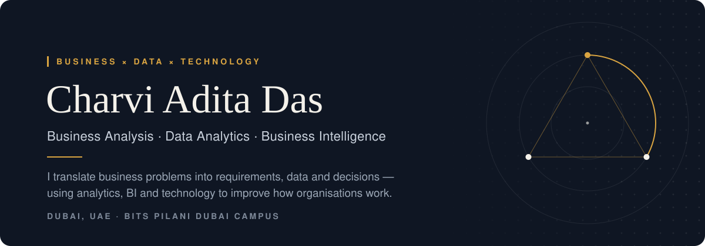
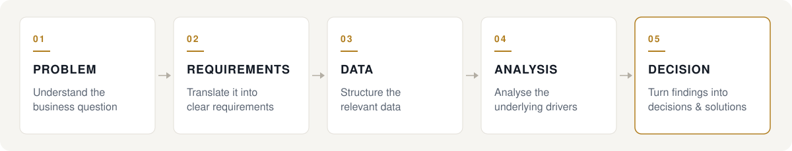

  <a href="https://www.linkedin.com/in/charviaditadas">LinkedIn</a> &nbsp;·&nbsp;
  <a href="mailto:charviaditadas@gmail.com">Email</a> &nbsp;·&nbsp;
  <a href="https://github.com/CharviAditaDas">GitHub</a>

 

## Business × Data × Technology

I work where business questions, data and technology meet — turning processes into requirements, requirements into analysis, and analysis into systems and decisions people can act on.

<table>
  <tr>
    <th align="left" width="33%">Business</th>
    <th align="left" width="33%">Data</th>
    <th align="left" width="33%">Technology</th>
  </tr>
  <tr>
    <td valign="top">
      Business analysis 
      Requirements gathering 
      Stakeholder management 
      Process optimisation 
      KPI tracking 
      Strategic problem solving
    </td>
    <td valign="top">
      Data analytics 
      Business intelligence 
      Data visualisation 
      Dashboard development 
      Operational analytics 
      Reporting
    </td>
    <td valign="top">
      Python · SQL 
      Excel · Power BI 
      AI / NLP 
      Digital transformation 
      Process automation
    </td>
  </tr>
</table>

 

## How I Approach Problems

I start by understanding the business problem, translate it into requirements, structure the relevant data, analyse the underlying drivers, and turn the findings into decisions or scalable solutions.

 

## Selected Work

### 01 — Employer Relationship Management CRM

A CRM for a university Career Services division, centralising every employer relationship — contacts, conversations, follow-ups and the opportunities they produce.

**Problem** &nbsp; When two coordinators independently add the same employer, the relationship history splits and nobody can tell which record is current. Records had to be centralised without exposing one coordinator's contacts and notes to another.

**What I worked on** &nbsp; Requirements, workflows and system architecture · employer profiles and contact management · a fifteen-stage recruitment pipeline · meeting logs, interview tracking, tasks and follow-up reminders · role-based access with a shared division directory · search · dashboards and reporting

**Technology** &nbsp; Next.js · React · TypeScript · PostgreSQL (Supabase) · row-level security

**Impact / Scale** &nbsp; 149 / 149 security assertions passing · row-level security on 23 tables · 33 application routes · CSV export across ten modules

**Explore →** &nbsp; [github.com/CharviAditaDas/erms](https://github.com/CharviAditaDas/erms)

 

### 02 — Paperless Career Fair Platform

A platform for running a university career fair without paper résumés, turning every recruiter–candidate interaction into structured recruitment data.

**Problem** &nbsp; Paper résumés get separated from the conversations they belong to, and Career Services has no reliable record of who met whom. Badge-scanning alternatives add their own friction: printed badges, cameras and a scanning app on every recruiter's phone.

**What I worked on** &nbsp; Business requirements, recruitment workflows and functional specifications · role-based access for students, recruiters, administrators, coordinators and volunteers · student registration and check-in · candidate identification by a six-character code · candidate bookmarking, pipeline stages and private interview notes · recruiter and administrator dashboards · multi-event management and reporting

**Technology** &nbsp; Next.js · React · TypeScript · PostgreSQL · Drizzle ORM · Zod

**Impact / Scale** &nbsp; Five user roles · 20-table schema · seven CSV reports · 83 integration assertions

**Explore →** &nbsp; [github.com/CharviAditaDas/paperless-career-fair-platform](https://github.com/CharviAditaDas/paperless-career-fair-platform)

 

### 03 — AI Resume Screening & Talent Intelligence Platform

An evidence-first recruitment platform: every claim it makes about a candidate traces back to the line of the résumé it came from.

**Problem** &nbsp; Résumé screeners tend to infer skills a candidate never claimed, and recruiters then act on them. Scores that shift between runs are hard for a recruiter to defend.

**What I worked on** &nbsp; Résumé parsing and ATS analysis · skill and requirement extraction from job postings · evidence-based job matching · deterministic scoring and ranked applicant lists · AI feedback and interview preparation for candidates · interview kits for recruiters

**Technology** &nbsp; Next.js · TypeScript · PostgreSQL (Supabase) · LLMs (Groq) · NLP · Zod

**Impact / Scale** &nbsp; 220 automated assertions · 78 row-level security policies · 27-table schema · decision support only — no candidate is ever auto-rejected

**Explore →** &nbsp; [github.com/CharviAditaDas/talent-intelligence-platform](https://github.com/CharviAditaDas/talent-intelligence-platform)

 

### 04 — Student Analytics & Placement Intelligence Platform

An analytical view of student and recruitment data built to support placement planning.

**Problem** &nbsp; Placement planning depends on reading student profiles, academic performance, placement preferences and recruitment data together rather than in isolation.

**What I worked on** &nbsp; Data cleaning, transformation and modelling · analysis · dynamic dashboards with filtering, segmentation and drill-down · reporting

 

### 05 — Real-Time AI-Driven Business Analysis

An e-commerce analytics case: diagnosing a conversion problem, then scaling review classification without scaling manual effort.

**Problem** &nbsp; Conversion fell 31.8% month-over-month while traffic stayed essentially flat (+0.7%) — the issue sat in the funnel, not in traffic volume.

**What I worked on** &nbsp; A KPI framework across demand, view-to-cart and view-to-purchase on 200,000+ behavioural events · a BERT vs XGBoost sentiment comparison on a 400,000-review corpus, explained with SHAP · confidence-banded, rule-based auto-actioning, with uncertain cases routed to manual review · deployment and inference trade-offs between the two models

**Technology** &nbsp; Python · SQL · Pandas · BERT · XGBoost · SHAP · Power BI

**Impact / Scale**

<table>
  <tr>
    <td align="center" width="25%"><h3>31.8%</h3>month-over-month conversion decline, with traffic at +0.7%</td>
    <td align="center" width="25%"><h3>94.2% vs 84.1%</h3>sentiment accuracy, BERT vs XGBoost</td>
    <td align="center" width="25%"><h3>0.99</h3>ROC-AUC</td>
    <td align="center" width="25%"><h3>95%</h3>of classifications auto-actioned, at 95.9% accuracy</td>
  </tr>
</table>

 

### 06 — Cross-Age Face Verification

Research into how reliably face-verification models recognise the same person across age gaps.

**Problem** &nbsp; Facial appearance changes with age, which makes identity verification across age gaps a harder test than same-age matching.

**What I worked on** &nbsp; Evaluated ArcFace, SFace and Facenet512 through DeepFace across 210+ test cases, comparing accuracy, precision, recall and F1

**Technology** &nbsp; Python · DeepFace · ArcFace · SFace · Facenet512

**Impact / Scale** &nbsp; 210+ test cases · presented at an academic conference

 

## Experience

### Business Analyst — Solar (Product & Sales)
**TÜV Rheinland Group** &nbsp;·&nbsp; Jun 2026 – Aug 2026

- Market research and competitor analysis across the solar sector — product offerings, industry trends, positioning and opportunities
- Analysed sales, product and customer data to build Excel reports and dashboards
- Prepared presentations for management

### Student Coordinator — Career Services Division
**BITS Pilani Dubai Campus** &nbsp;·&nbsp; Sep 2024 – Present

- Campus recruitment and employer relationships, including stakeholder communication across 500+ students
- Recruitment initiatives and career fairs — core team for three fairs (Jan 2025, Apr 2025, Jan 2026), coordinating with 50+ recruiters
- Cross-functional coordination and event logistics

 

## Selected Impact

<table>
  <tr>
    <td align="center" width="33%"><h2>9.83 / 10</h2>CGPA, BITS Pilani Dubai Campus</td>
    <td align="center" width="33%"><h2>200K+</h2>e-commerce behavioural events analysed</td>
    <td align="center" width="33%"><h2>400K</h2>review sentiment corpus</td>
  </tr>
  <tr>
    <td align="center" width="33%"><h2>94.2%</h2>BERT sentiment accuracy</td>
    <td align="center" width="33%"><h2>95%</h2>of classifications auto-actioned</td>
    <td align="center" width="33%"><h2>210+</h2>research test cases</td>
  </tr>
</table>

 

## Toolkit

<table>
  <tr><td width="28%"><b>Business Analysis</b></td><td>Requirements gathering · Stakeholder management · Process optimisation · KPI tracking · Reporting</td></tr>
  <tr><td><b>Analytics &amp; BI</b></td><td>SQL · Excel · Power BI · Data visualisation · Dashboard development · Business intelligence</td></tr>
  <tr><td><b>Programming</b></td><td>Python · C · Java</td></tr>
  <tr><td><b>AI &amp; Data Science</b></td><td>Machine learning · NLP · LLM applications · OpenCV · DeepFace · BERT · XGBoost</td></tr>
  <tr><td><b>Digital Transformation</b></td><td>CRM · Process automation · Enterprise applications · AI-powered solutions</td></tr>
</table>

 

## Certifications

<table>
  <tr>
    <td valign="top" width="50%">
      <b>Data Analytics &amp; Business</b>  
      Data Science &amp; Analytics HP LIFE  
      Business Communications HP LIFE  
      Presenting Data HP LIFE  
      Data Analytics Job Simulation Deloitte · Forage  
      GenAI Powered Data Analytics Job Simulation Tata · Forage  
      Data Visualisation: Empowering Business with Effective Insights Tata · Forage
    </td>
    <td valign="top" width="50%">
      <b>Data, Excel &amp; SQL</b>  
      Data Visualization in Excel Macquarie University · Coursera  
      Excel Fundamentals for Data Analysis Macquarie University · Coursera  
      Chat with Your Data: Generative AI-Powered SQL Data Analysis Vanderbilt University · Coursera  
      Programming for Everybody (Getting Started with Python) University of Michigan · Coursera  
      <b>Artificial Intelligence</b>  
      AI Foundations OpenAI Academy
    </td>
  </tr>
</table>

 

## Education

**B.E. Computer Science** — BITS Pilani Dubai Campus &nbsp;·&nbsp; Sep 2024 – Sep 2028 &nbsp;·&nbsp; CGPA 9.83 / 10

**CBSE Class 12** — Delhi Public School &nbsp;·&nbsp; 2024

 

## Beyond Analytics

National-level badminton player &nbsp;·&nbsp; Represented BITS Pilani at intercollegiate technology and entrepreneurship events &nbsp;·&nbsp; Data challenges and innovation hackathons

 

---

### Building better decisions with data.

Business problems → structured analysis → scalable solutions.

[LinkedIn](https://www.linkedin.com/in/charviaditadas) &nbsp;·&nbsp; [Email](mailto:charviaditadas@gmail.com) &nbsp;·&nbsp; [GitHub](https://github.com/CharviAditaDas)

